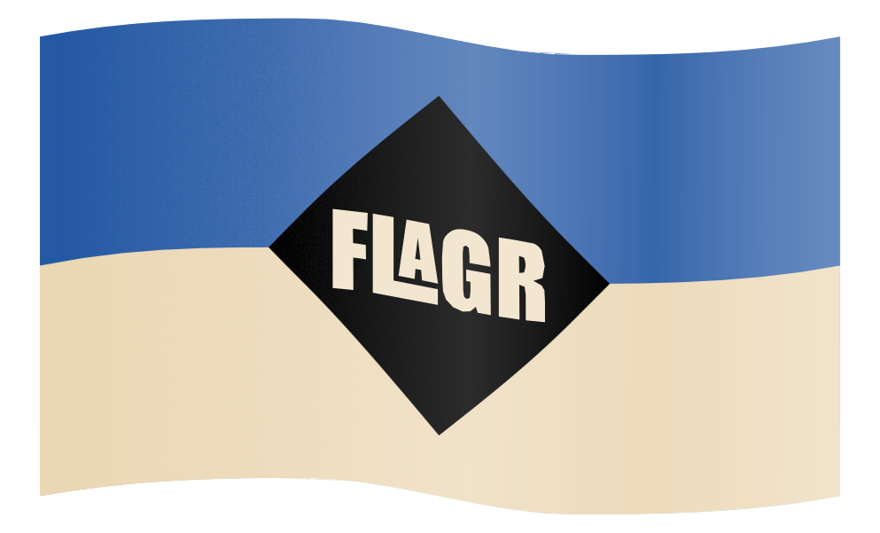

  

  
  
  
  
  

## Overview

This is a simple web app that identifies flags based on keywords and patterns. It fetches country data from the [REST Countries API](https://restcountries.com/).

Then again, you could just try to memorize the flags.

---

## Features

- **Search by Description**: Filter flags using keywords from their flag description.
- **Search by Patterns**: Filter flags using predefined pattern buttons.
- **Alphabetical Sorting**: Flags are sorted and grouped by the first letter of the country name.
- **Toggle Names**: Show or hide country names below the flags.
- **Toggle Mode**: Switch between "Overview Mode" (compact view) and "Detail Mode" (expanded view).

---

## Usage

Test the [Flagr web app here](flagger.ironlegit.com) or run it locally.

### Prerequisites

- Docker and Docker Compose installed.
- A [REST Countries API key](https://restcountries.com/).

### Setup

1. **API Key**: Add REST Countries API key in `.env`
2. **Run the App**: Start the development server with `docker-compose up`
3. **Access the App**: Open your browser and open [localhost:8080](http://localhost:8080)
